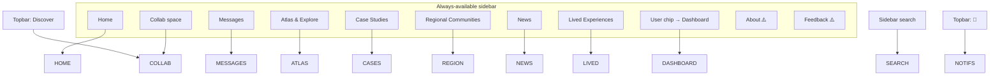
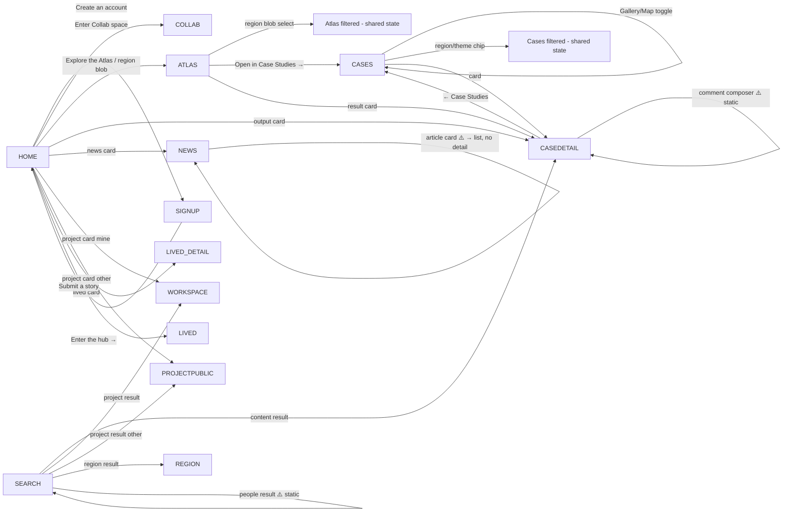
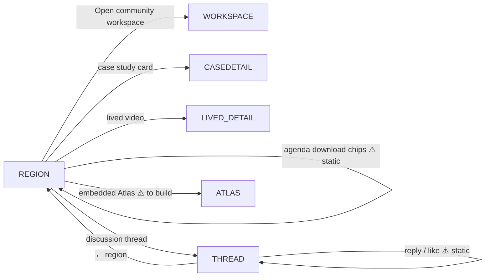
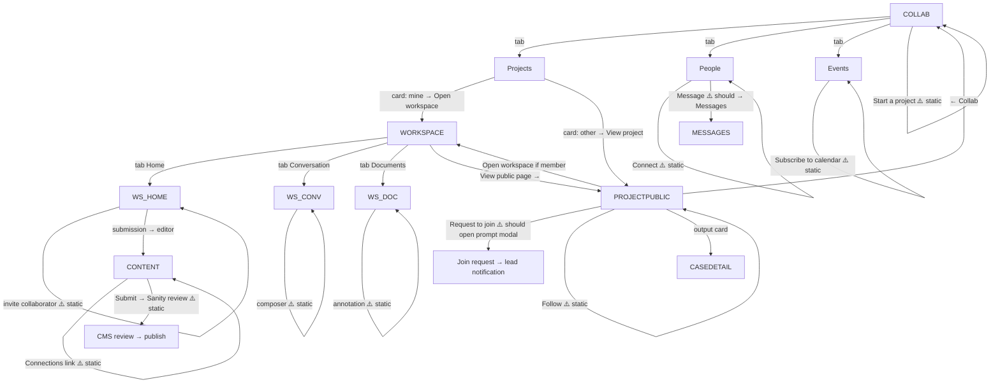
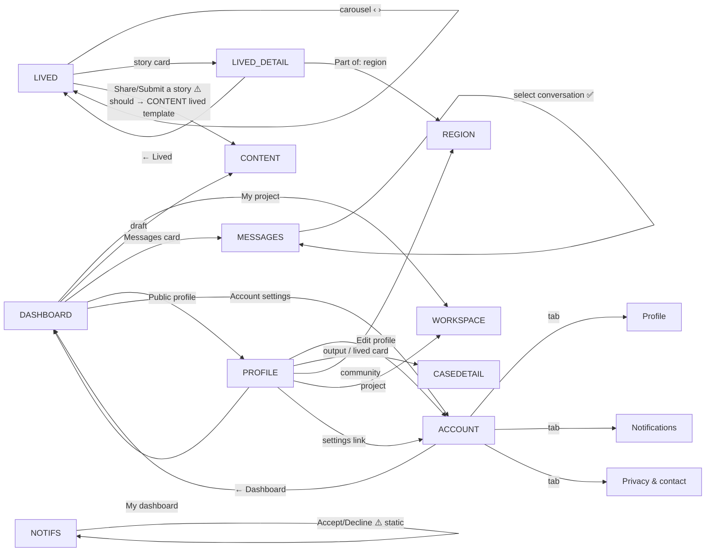

# CCM Hub — Flow Blueprint, Wiring Audit & Handoff Guide

Companion to `WIREFRAMES.md` (spec) and `SPEC.md` (decisions). This doc:
1. Charts every screen-to-screen transition (Mermaid — paste into any Mermaid viewer / GitHub / Figma FigJam plugin to render).
2. A **click-by-click wiring table** for every interactive element, with **✅ wired / ⚠️ gap** flags.
3. A **feature → location matrix**.
4. **What you need from a designer** to take this to a production app.

---

## 1. Master navigation map

Persistent **sidebar** (always available) + **topbar** reach these hubs from anywhere:

## 2. Public / discovery flows

## 3. Regional community flow

## 4. Collaboration flows (the core)

## 5. Account / personal flows

---

## 6. Click-by-click wiring table

Legend: ✅ wired · ⚠️ intentional static affordance (prototype) · ❌ gap to fix.

| Screen | Element | Target / behavior | Status |
|---|---|---|---|
| **Shell** | sidebar nav ×8 | route to each hub | ✅ |
| Shell | sidebar About / Feedback | — | ❌ no page |
| Shell | user chip | Dashboard | ✅ |
| Shell | search input | Search (live) | ✅ |
| Shell | topbar Discover | Collab | ✅ (♻️ dup of sidebar) |
| Shell | topbar 🔔 | Notifications | ✅ |
| Shell | mobile ☰ / scrim | open/close drawer | ✅ |
| **Home** | Create an account | Signup | ✅ |
| Home | Enter Collab space | Collab | ✅ |
| Home | hero carousel dots / auto | change slide | ✅ |
| Home | output cards | Case detail | ✅ |
| Home | people widget | — (display) | ⚠️ |
| Home | open-project cards | Workspace / Project public | ✅ |
| Home | Read the Global Agenda | — | ⚠️ |
| Home | region blob map | Atlas | ✅ |
| Home | news cards | News list | ⚠️ no article detail |
| Home | mini-calendar / Subscribe | — | ⚠️ static |
| Home | lived carousel + arrows | slide / Lived detail | ✅ |
| Home | Submit a story | Lived | ⚠️ should → Content editor |
| Home | partner logo slots | — (image-slots) | ⚠️ |
| **Signup** | step Continue/Back | advance onboarding | ✅ |
| Signup | region / role / interest / intent pills | select (visual) | ⚠️ static select |
| Signup | Enter the hub → | Home | ✅ |
| **Dashboard** | my project / draft / messages / profile / account | route | ✅ |
| **Profile** | Edit / Dashboard / settings | Account / Dashboard | ✅ |
| Profile | output, lived, project, community cards | route to detail | ✅ |
| Profile | (viewer) Connect / Message | — | ⚠️ static |
| **Account** | 3 tabs | switch | ✅ |
| Account | field edits / Save | — | ⚠️ static |
| Account | section + notif + privacy toggles | flip (visual) | ⚠️ static |
| **Collab** | Projects/People/Events tabs | switch | ✅ |
| Collab | region filter chips | filter (shared) | ✅ |
| Collab | Start a project | — | ❌ no create flow |
| Collab | project card | Workspace / Project public | ✅ |
| Collab | Connect | — | ⚠️ static |
| Collab | Message | — | ❌ should → Messages |
| Collab | RSVP / +Calendar / Subscribe | — | ⚠️ static |
| **Project public** | Request to join | — | ❌ should open prompt modal → notification |
| Project public | Follow | — | ⚠️ static |
| Project public | Open workspace (member) | Workspace | ✅ |
| Project public | output cards / ← Collab | route | ✅ |
| **Workspace** | Home/Conversation/Documents tabs | switch | ✅ |
| Workspace | View public page → | Project public | ✅ |
| Workspace | task cycle / move / delete / add | mutate state | ✅ |
| Workspace | submission row | Content editor | ✅ |
| Workspace | invite collaborator | — | ⚠️ static |
| Workspace | channel / DM select | switch conversation | ✅ |
| Workspace | message composer / send | — | ⚠️ static |
| Workspace | file select | switch doc | ✅ |
| Workspace | version × language chips | — | ⚠️ static |
| Workspace | annotation add / resolve | — | ⚠️ static |
| **Content editor** | template picker | — | ⚠️ static (should reflow) |
| Content editor | add / reorder block | — | ⚠️ static |
| Content editor | Connections link | — | ⚠️ static |
| Content editor | Submit / pipeline | — | ⚠️ static |
| **Atlas** | data layer / theme / region facets | filter (shared) | ✅ |
| Atlas | region blob | filter / select | ✅ |
| Atlas | region → country drill | — | ❌ to build |
| Atlas | Open in Case Studies → | Cases | ✅ |
| Atlas | result cards | Case detail | ✅ |
| **Cases** | Gallery / Map toggle | switch | ✅ |
| Cases | region / theme chips | filter (shared) | ✅ |
| Cases | cards (4 layouts) | Case detail | ✅ |
| **Case detail** | Editorial / Feature / Report | switch layout | ✅ |
| Case detail | Mobile toggle | phone frame | ✅ |
| Case detail | ← Case Studies | Cases | ✅ |
| Case detail | comment composer | — | ⚠️ static |
| **Region** | Get involved | — | ⚠️ static |
| Region | Open community workspace | Workspace | ✅ |
| Region | case / lived / team cards | route to detail | ✅ |
| Region | discussion thread | Thread | ✅ |
| Region | agenda download chips | — | ⚠️ static |
| Region | embedded Atlas | — | ❌ to build |
| **News** | All / Global / region filter | filter | ✅ |
| News | article cards | News list (self) | ❌ no article detail |
| **Lived** | carousel arrows | slide | ✅ |
| Lived | story cards | Lived detail | ✅ |
| Lived | Share / Submit a story | Lived (self) | ❌ should → Content editor |
| Lived detail | ← Lived / Part-of region | Lived / Region | ✅ |
| Lived detail | media play | — | ⚠️ static |
| **Messages** | conversation select | switch | ✅ |
| Messages | composer / send | — | ⚠️ static |
| **Thread** | reply / like / composer | — | ⚠️ static |
| **Notifications** | Accept / Decline | — | ❌ no state change |
| Notifications | Mark all read | — | ⚠️ static |

### Gaps to close — RESOLVED this revision
All nine wired up: ✅ News article detail · ✅ Lived "Submit a story" → Content editor · ✅ Project "Request to join" → prompt modal · ✅ Collab/Profile "Message" → Messages · ✅ "Start a project" modal · ✅ Atlas region→country drill ("Explore countries →") · ✅ Region embedded Atlas entry · ✅ About / Feedback pages · ✅ Notifications Accept/Decline (dismisses the request).
Remaining ⚠️ items are intentionally-static affordances (composers, toggles, downloads) fine for a clickable prototype; wire to the backend at build.

### Navigation note — NO TOPBAR
The app has **no topbar**. Everything lives in the sidebar: search, Home, Collab, Messages, Notifications (badge), Atlas, Case Studies, Regional Communities, News, Lived Experiences, About/Feedback, and the user chip (→ Dashboard). On mobile (`<980px`) the sidebar is a **drawer**: hidden by default, opened by a floating ☰ button (top-left), closed by a dark scrim. The drawer is mounted on demand (not transform-toggled) for reliable open/close.

---

## 7. Feature → location matrix

| Feature | Available on |
|---|---|
| Universal search | sidebar (all screens) → Search results |
| Region filter (shared state) | Atlas, Case Studies, Collab, News, Region |
| Theme filter | Atlas, Case Studies |
| Stylized blob map | Atlas, Cases (map), Home, Region (embed) |
| Content cards (4 layouts) | Cases, Home, Profile, Region, Search, Project public |
| Content detail + layout switch + mobile | Case detail (model for News/Lived detail) |
| Comments (public) | Case detail (+ News/Lived when built) |
| Discussion threads | Region → Thread |
| Doc annotations | Workspace → Documents |
| Messaging (channels/DM, grouped) | Messages, Workspace → Conversation |
| Project management (plan, tasks, submissions, team, events, outputs) | Workspace → Home |
| Inline editable tasks | Workspace → Home |
| Multilingual + versioned documents | Workspace → Documents, Content editor, output pages |
| Block content authoring + templates + connections | Content editor |
| CMS pipeline (draft→review→published) | Content editor, Workspace submissions |
| People discovery (Seeking/Offering/Member) | Collab → People, Home, Search |
| Project discovery (public/private, open calls) | Collab → Projects, Home, Search |
| Events (RSVP, add/subscribe calendar, scope) | Collab → Events, Home, Region, Dashboard |
| Follow / Request to join / Offer | Project public, profiles |
| Lived experiences (video/audio/written + carousel + submit) | Lived, Home, Region, Profile |
| Profile (prompts, experience, publications, communities, events, lived) | Profile |
| Account (profile/notifications/privacy tabs, section visibility) | Account settings |
| Notifications (Requests/Today/Earlier, Accept/Decline) | Notifications, topbar bell |
| Dashboard (projects, tasks, drafts, messages, upcoming) | Dashboard |
| Onboarding (region, role, interests, intent) | Signup |
| Mobile drawer nav | all (≤980px) |

---

## 8. What you need from a designer to reach a production app

This prototype is the **interaction + visual reference**. To hand off for engineering, a designer typically delivers:

**A. Design system / tokens (foundational)**
- Finalised **design tokens** (the §1.2 colors, type, spacing, radius, shadow) as a shared file — JSON / Style Dictionary / Tailwind config / CSS variables. You already have the Tailwind theme; align tokens to it 1:1.
- **Component library in Figma** (or code): every item in WIREFRAMES §5 / FLOWS §7 as a component with **variants & states** (default/hover/active/focus/disabled/loading/error) and **auto-layout** so it's responsive. Buttons, chips, cards, tabs, toggles, avatars, inputs, modals, toasts.
- Icon set decision (icon font / SVG set) — the prototype uses glyph placeholders.

**B. Screens (high-fidelity)**
- Each of the 19 screens at **desktop + mobile** (and tablet if needed), pulling from the component library — not one-off art.
- **All states per screen** (empty / loading skeletons / error / permission-gated / logged-out vs in). The prototype shows the happy path; production needs the rest.
- **Redlines / specs** auto-generated from Figma (spacing, sizes, tokens) via Dev Mode.

**C. Flows & prototype**
- This **flow blueprint** (the Mermaid charts) as the navigation contract, plus an interactive **Figma prototype** wiring the key flows (§2–5) so engineers and stakeholders can click through.
- The **gap list** (§6) resolved into real destinations.

**D. Content & data contract**
- The **data model** (WIREFRAMES §3) confirmed with engineering, mapped to the **Sanity schema** (content types, blocks, versions/langs, references for connections, the review/publish workflow + roles).
- **Taxonomy** finalised (region/theme/population/type/stage/status) as Sanity fields with the shared color map.
- Real **copy** (microcopy, empty states, errors, notification strings) and real **illustrations/photography** (the prototype uses image-slots + Sanity CDN placeholders).

**E. Specifics this product needs**
- **Localization** plan (EN/FR/AR/ES, RTL) — fonts already specced; need translated strings + RTL mirroring rules.
- **Accessibility** annotations (focus order, ARIA, contrast sign-off) — WCAG AA.
- **Permissions matrix** (visitor / member / collaborator / convenor-editor) per screen & action.
- **Analytics/events** to track (signups, joins, submissions, RSVPs).

**F. Handoff format**
Typical deliverables engineers expect: a **Figma file** (tokens + library + screens + prototype, Dev Mode on), this **markdown spec set** (`WIREFRAMES.md`, `SPEC.md`, `FLOWS.md`), the **Sanity schema doc**, and an **asset package** (logos, illustrations, icons, fonts). From there the front end is built component-first against the tokens, wired to Sanity via its API, with the CMS review workflow configured in Sanity Studio.

> I (as your designer in this tool) can produce: the hi-fi screens & states, the component sheets, refined flows, the token file, and the Sanity-schema-shaped data spec — tell me which to generate next. The interactive coded prototype here doubles as the clickable reference.
